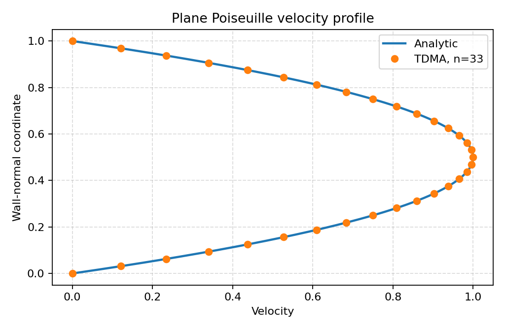
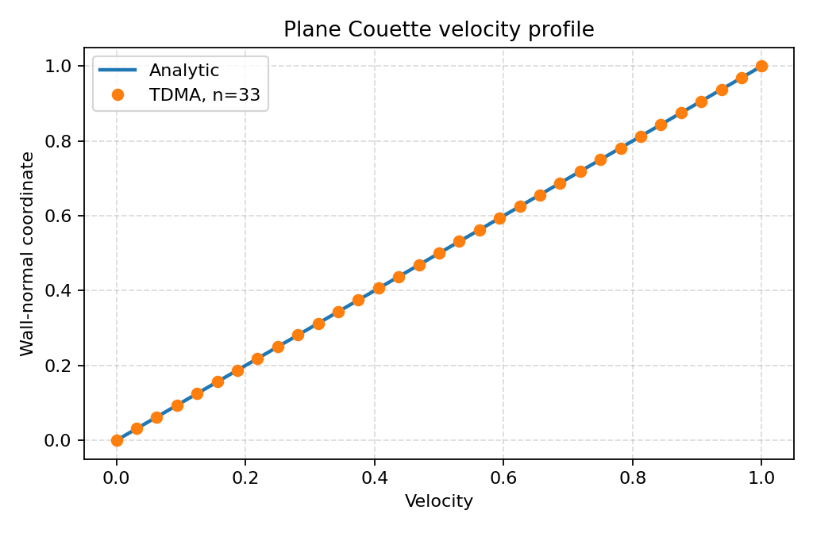
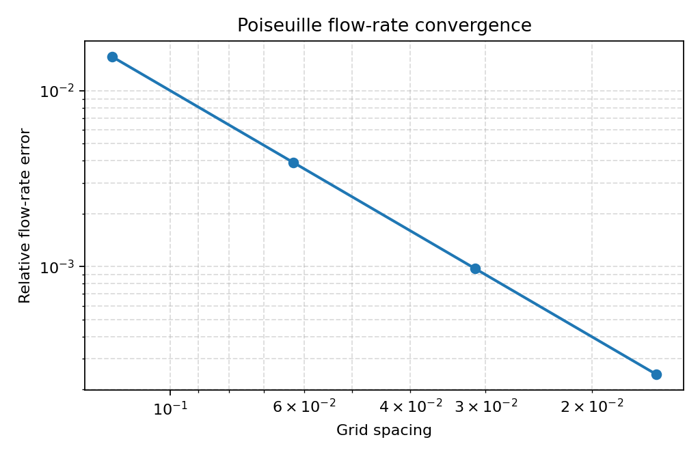
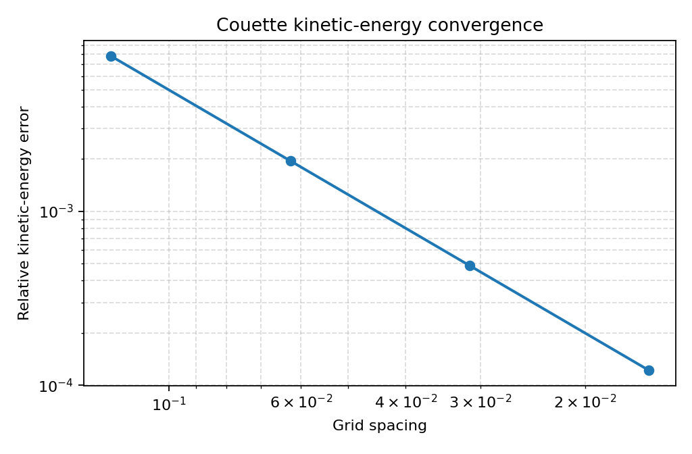

# SimpleCFD

SimpleCFD is a compact research software project for one-dimensional finite
volume CFD. It implements a staggered-grid pressure-velocity solver, analytic
benchmark generators, convergence studies, and a command-line workflow that
exports reproducible CSV, Markdown, and PNG artifacts.

The project is intentionally scoped to 1D flows. Its purpose is not to be a
general CFD package, but to provide a small, inspectable codebase where the
numerics, tests, and generated evidence can be reviewed end to end.

## Highlights

- One-dimensional finite volume method on a staggered pressure/velocity grid.
- SIMPLE, SIMPLEC, and SIMPLER pressure-velocity coupling strategies.
- Upwind and central-difference convection schemes.
- Registered nozzle and variable-area duct cases, including Versteeg and
  Malalasekera example 6.2.
- Analytic Poiseuille and Couette benchmarks with exact reference solutions.
- Mesh-refinement studies with L1, L2, Linf, and observed convergence order.
- CLI commands for solver runs, benchmark generation, and aggregate analytic
  verification.
- Pytest suite covering linear solvers, coefficient assembly, boundary
  conditions, pressure correction, solver loops, reports, CLI, packaging, and
  benchmark artifacts.
- Technical documentation under [`docs/`](docs/).

## Verification Snapshot

The analytic verification report below was generated with:

```bash
python -m simplecfd verify-analytic --output-dir docs/assets/analytic_verification
```

| Benchmark | Nodes | Profile L1 | Profile L2 | Profile Linf | Integral metric | Relative integral error | Finest observed integral order |
| --- | ---: | ---: | ---: | ---: | --- | ---: | ---: |
| Poiseuille | 33 | 1.60646e-15 | 1.88916e-15 | 3.10862e-15 | Flow rate | 9.76563e-4 | 2.0 |
| Couette | 33 | 1.26151e-15 | 1.45834e-15 | 2.33147e-15 | Kinetic energy | 4.88281e-4 | 2.0 |

The nodal velocity profiles are recovered to roundoff for these analytic
problems. Integral quantities still expose the expected second-order behavior
under mesh refinement.

## Results

| Plane Poiseuille | Plane Couette |
| --- | --- |
|  |  |
| Pressure-driven parabolic profile, validated against the analytic solution. | Moving-wall linear profile, validated against the analytic solution. |

| Poiseuille flow-rate convergence | Couette kinetic-energy convergence |
| --- | --- |
|  |  |

Generated benchmark artifacts include:

- Profile CSV files with numerical, analytic, and pointwise-error columns.
- Refinement CSV files with error norms and observed orders.
- Markdown summaries for individual benchmarks and aggregate verification.
- PNG figures for profiles, integral convergence, profile-error convergence,
  and observed profile orders.

## Benchmarks

### Versteeg 6.2 Nozzle Case

The main regression problem reproduces the one-dimensional nozzle example 6.2
from Versteeg and Malalasekera. It exercises the pressure-velocity solver,
momentum assembly, pressure correction, under-relaxation, mass-flow tracking,
and residual reporting.

### Plane Poiseuille Flow

The Poiseuille benchmark solves steady laminar flow between parallel plates:

```text
u(y) = (Delta p / L) y (H - y) / (2 mu)
```

It validates the numerical velocity profile, computes L1/L2/Linf errors, and
tracks flow-rate convergence over mesh refinement.

### Plane Couette Flow

The Couette benchmark solves steady moving-wall flow:

```text
u(y) = U_lower + (U_upper - U_lower) y / H
```

It validates no-slip wall behavior, the analytic linear profile, L1/L2/Linf
errors, and kinetic-energy convergence over mesh refinement.

## Installation

From the repository root:

```bash
python -m venv .venv
.venv\Scripts\activate
python -m pip install -e .[dev]
```

On macOS or Linux, activate the environment with:

```bash
source .venv/bin/activate
```

The package requires Python 3.11 or newer. After installation, it can be
imported as `simplecfd` and the console script is available as `simplecfd`.

## Quick Start

Run the test suite:

```bash
python -m pytest
```

## Continuous Integration

GitHub Actions runs the project quality gate on every push and pull request.
The CI workflow installs SimpleCFD in editable mode on Python 3.11 and 3.12,
verifies imports and CLI entry points, runs representative solver and
analytic-benchmark commands, and then executes the full pytest suite.

List available solver cases and coupling methods:

```bash
simplecfd list-cases
simplecfd list-methods
```

Run the Versteeg 6.2 regression case:

```bash
simplecfd run --case versteeg_6_2 --method simple --scheme upwind --output-dir outputs/run
```

Generate analytic benchmark artifacts:

```bash
simplecfd poiseuille --output-dir outputs/poiseuille_benchmark
simplecfd couette --output-dir outputs/couette_benchmark
simplecfd verify-analytic --output-dir outputs/analytic_verification
```

The same commands can be run without the installed console script:

```bash
python -m simplecfd run --case linear_nozzle_1d --method simple --scheme upwind --output-dir outputs/linear_nozzle
python -m simplecfd verify-analytic --output-dir outputs/analytic_verification
```

## CLI Outputs

The `run` command exports:

- `summary.csv`
- `residual_history.csv`
- pressure, velocity, and mass-flow profile CSV files
- `result.json`
- diagnostic plots under `plots/`

Solver controls can be overridden with:

```bash
simplecfd run --case versteeg_6_2 --method simplec --scheme central_difference \
  --max-iterations 200 --tolerance 1e-7 \
  --pressure-relaxation 0.7 --velocity-relaxation 0.7 \
  --output-dir outputs/simplec_run
```

The analytic benchmark commands export profile tables, convergence tables,
Markdown reports, and PNG figures. The aggregate verification command writes a
combined summary table and benchmark-specific artifact directories.

## Project Structure

```text
simplecfd/
  assembly/          Momentum and pressure-correction assembly
  boundary/          Boundary-condition helpers
  schemes/           Discretization schemes
  cases.py           Registered 1D solver problems
  cli.py             Command-line interface
  couette.py         Plane Couette analytic benchmark
  poiseuille.py      Plane Poiseuille analytic benchmark
  verification.py    Aggregate analytic verification report
tests/               Unit, regression, CLI, and artifact tests
docs/                Technical documentation and generated README assets
examples/            Small executable examples
```

## Documentation

- [`docs/architecture.md`](docs/architecture.md): package structure, module
  responsibilities, and execution flow.
- [`docs/numerical_methods.md`](docs/numerical_methods.md): finite-volume
  formulation, staggered mesh, SIMPLE-family coupling, schemes, and TDMA.
- [`docs/verification.md`](docs/verification.md): analytic benchmarks,
  convergence studies, error norms, and generated artifacts.
- [`docs/testing.md`](docs/testing.md): test organization and focused test
  commands.
- [`docs/limitations.md`](docs/limitations.md): current scope and unsupported
  capabilities.
- [`docs/developer_guide.md`](docs/developer_guide.md): installation,
  extension points, benchmark workflow, and documentation maintenance.

## Current Limitations

- The solver is 1D only.
- There is no 2D/3D mesh infrastructure.
- Turbulence models, transient integration, multiphase flow, and heat transfer
  are not implemented.
- The SIMPLE-family solver is designed for small educational and verification
  cases, not production-scale CFD.
- PISO is not implemented.
- Generated files under `outputs/` are local run artifacts and are intentionally
  ignored by Git.

## Roadmap

Planned work should stay aligned with the current 1D scope:

- Add more 1D analytic and manufactured-solution benchmarks.
- Expand convergence and regression dashboards from existing CSV outputs.
- Add a CI status badge once the repository remote path is finalized.
- Improve API documentation for solver components and benchmark extension
  points.
- Package a small set of reproducible reference reports for releases.

## References

- H. K. Versteeg and W. Malalasekera, *An Introduction to Computational Fluid
  Dynamics: The Finite Volume Method*, second edition.
- Classical plane Poiseuille and plane Couette solutions for steady laminar
  flow between parallel plates.

## License

SimpleCFD is distributed under the MIT License. See [`LICENSE`](LICENSE).
